# Flowgram

Flowgram is an Instagram clone app built with [Vue.js](https://vuejs.org/).

## Installation and running the project

#### Installing the dependencies

```js
npm i
```

#### Running the project

```js
npm run dev
```

#### Running the tests

```js
npm run cypress
```

## Technologies Used

[VueJS](https://vuejs.org/) - the progressive JavaScript framework

[Vite](https://vitejs.dev/) - next generation frontend tooling

[Vue Router](https://router.vuejs.org/) - the official router for VueJS

[Vuelidate](https://vuelidate-next.netlify.app/) - a lightweight model-based validation for Vue.js

[Pinia](https://pinia.vuejs.org/) - the official store library for VueJS

[Tailwind CSS](https://tailwindcss.com/) - a utility-first CSS framework

[Flowbite](https://flowbite.com/) - a set of design tokens and components based on the popular Tailwind CSS framework

[Firebase](https://firebase.google.com/) - an app development and hosting platform

[Cypress](https://docs.cypress.io/) - an E2E testing framework for applications

[TypeScript](https://www.typescriptlang.org/) - the strongly typed programming language that builds on JavaScript

[Fontawesome](https://fontawesome.com/) - the Internet's icon library and toolkit, used by millions of designers, developers, and content creators

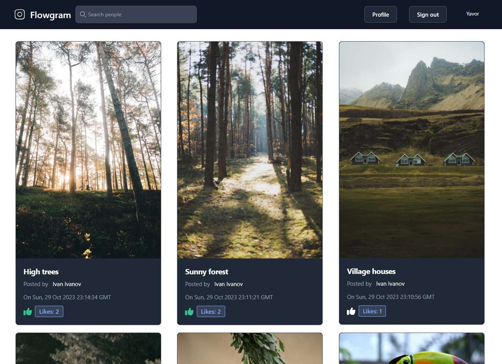

## Features

### Authentication

The authentication is provided by [Firebase](https://firebase.google.com/). Users can create accounts, register, log in, log out, post content, follow/unfollow each other, like posts, edit and delete post content.

The Sign in and Registration forms use [Vuelidate](https://vuelidate-next.netlify.app/) for validation. All fields show the appropriate errors when the user input doesn't meet the fields' validation criteria. The Sign up and Login buttons only become active when all fields have been validated.

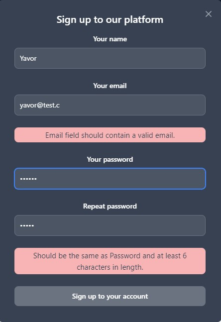
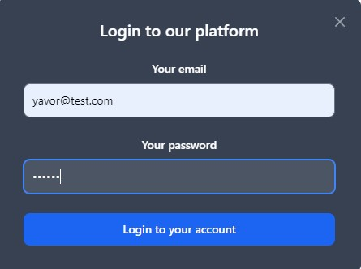

### Adding posts

Adding new posts can be done through the profile section for each logged in user. Clicking on the Profile button in the main menu takes you to your profile, where you can see only your posts.

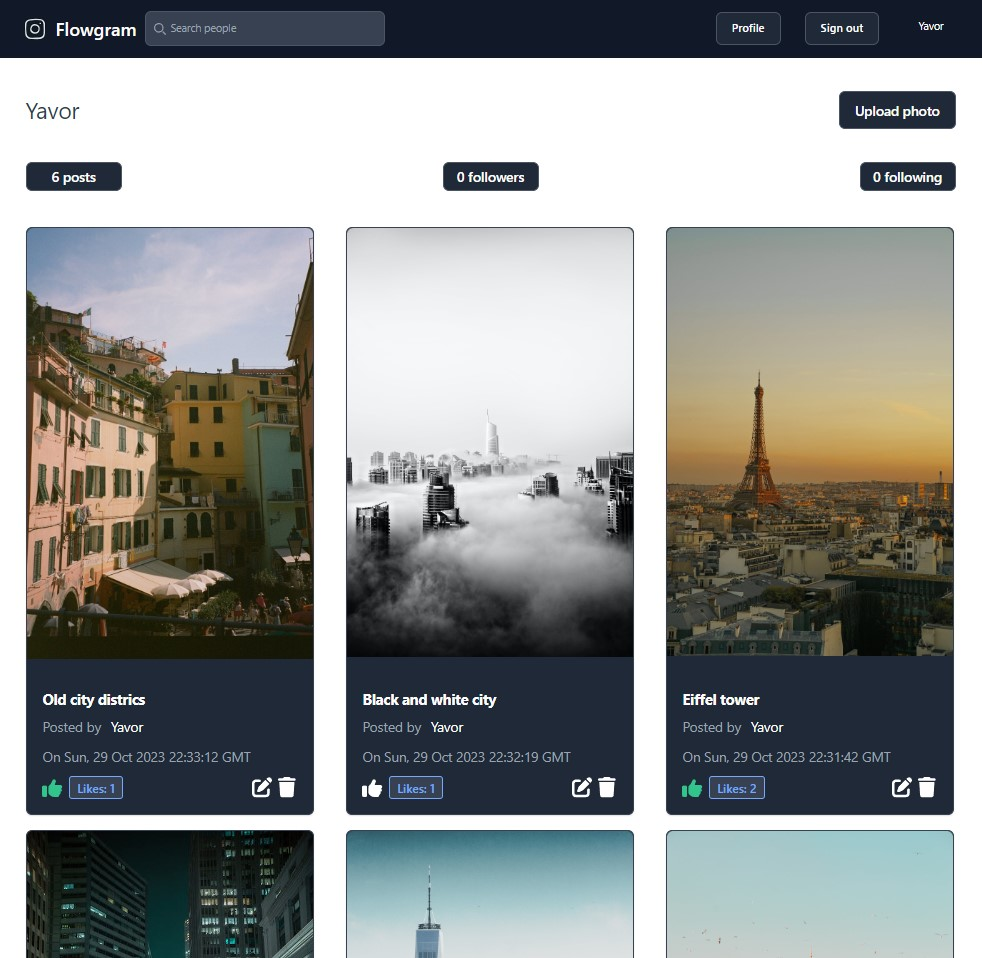

Clicking on the Upload photo button presents you with an upload modal, through which you can upload a photo and add a description for the post. All data in saved in Firestore.

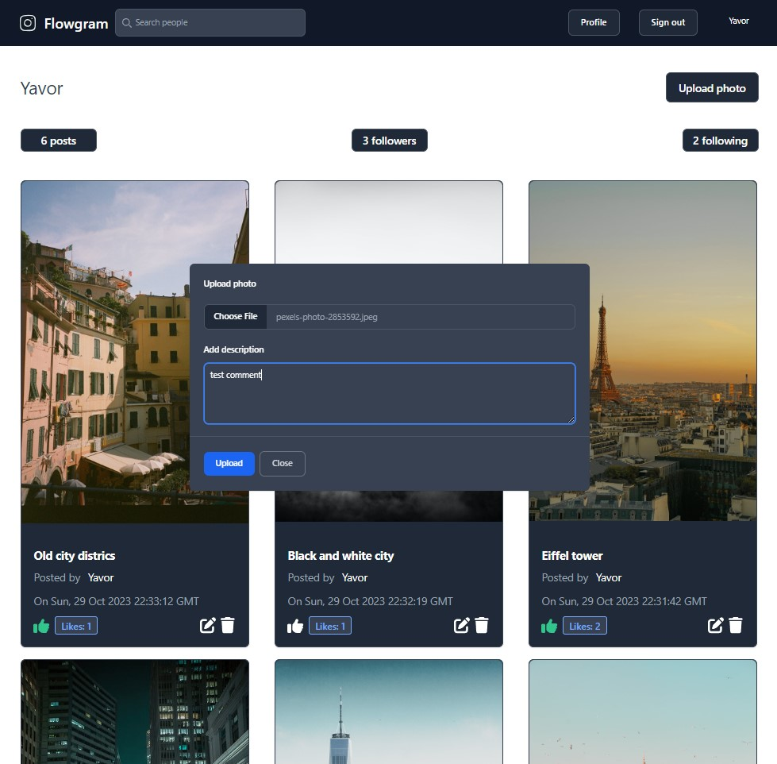

The newly added post always displays first, both on the user profile and the user timeline as all posts are sorted by date when post data is requested from Firestore.

### Tracking the number of people you are following, your followers and the number of posts you've made

The user bar on the user profile offers that information displayed in 3 tabs under your username:

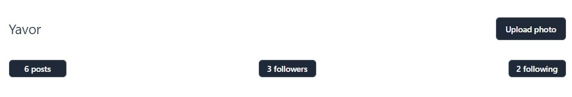

### Seing other peoples' posts on your timeline

On your timelime, you can see the posts of the people you're following along your own posts, again ordered by post date.

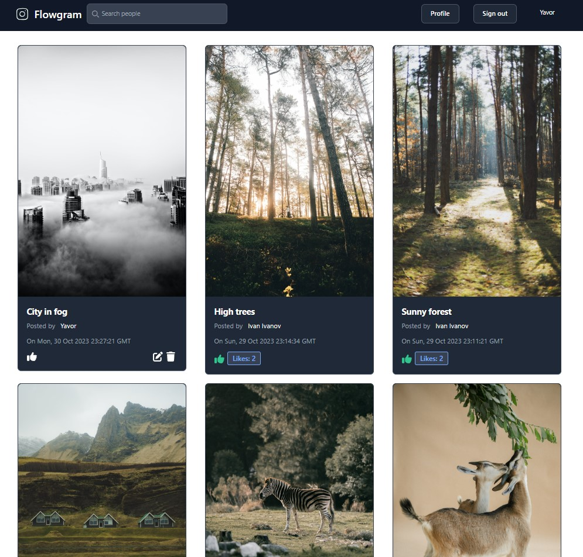

### Editing and deleting posts

Only your posts display the edit and delete icons. Clicking the edit icon opens/hides the Edit description field to allow for new post description. The delete icon simply deletes the entire post together with the associated image.

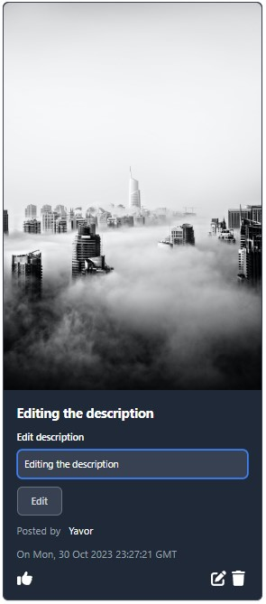

### Liking/disliking posts and tracking your own likes

Each post displays the number of likes it has received from different users. The posts containing your like are colored in green.

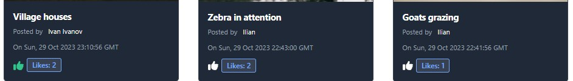

### Infinite scrolling for posts

By default, the user timeline displays a limited number of posts. Scrolling to the end of the page, fetches more posts from the database to display them onscreen. It is an alternative to post pagination.

### Visiting other peoples' profiles

Typing a letter in the search bar will display the profiles of all users whose profile name begins with it.

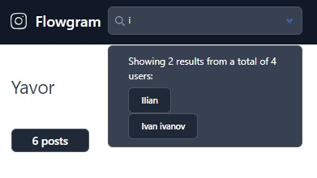

Clicking on a user will take you to his profile where you can view his posts, the number of people he follows, and is followed by, as well as allow you to follow/unfollow the user.

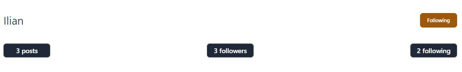

### Responsiveness

The app's design is also responsive and can be used with mobile devices:

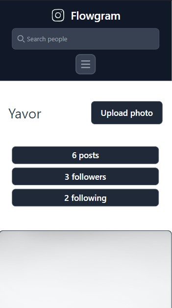

### Unit tests

E2E tests are present in the "cypress" folder and can be run in the browser with "npm run cypress".

---

The live app is hosted at [Firebase](https://flowgram-97998.web.app/).
